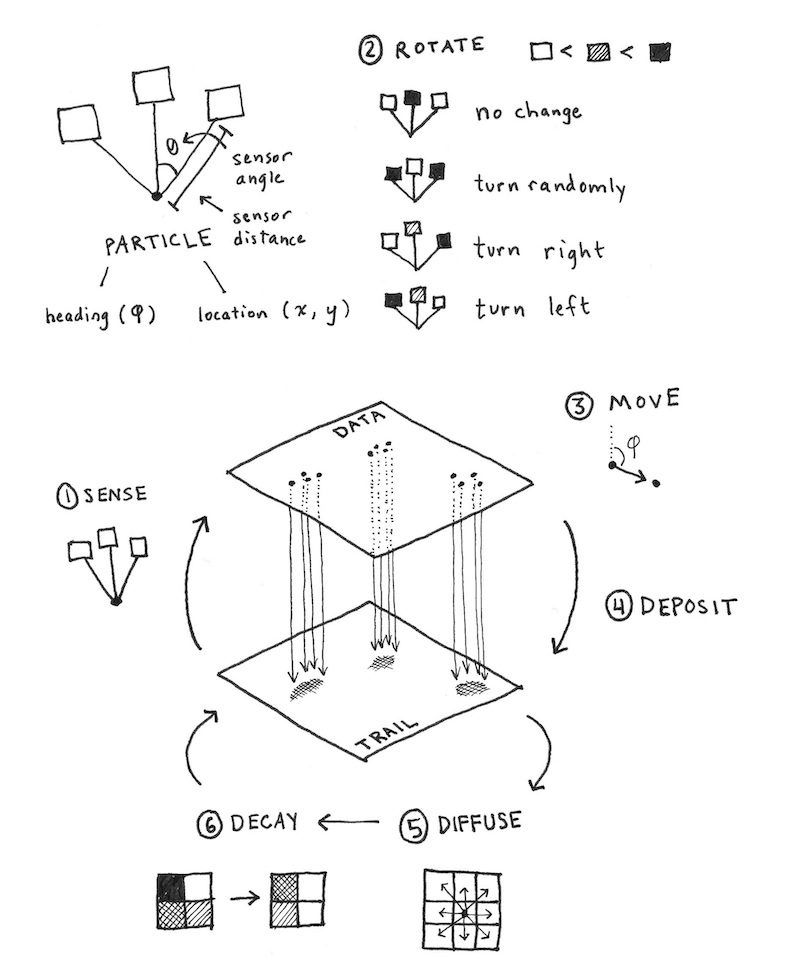

---
authors:
- admin
categories:
- Generative
date: "2020-10-03T00:00:00Z"
draft: false
featured: false
image:
  caption: ""
  focal_point: ""
lastmod: "2020-10-03T00:00:00Z"
projects: []
subtitle: Mold pattern formation results in abstract images
summary: Cellular automata programmed to simulate actual cellular travel patterns
tags:
- Generative
- Cellular Automata
title: 'Abstractions'
---

Antonio Sánchez Chinchón aka [Fronkenstein](https://fronkonstin.com/) is a favorite producer of generative images. Here's he's created code for images from work on mold pattern formation and efforts to simulate those patterns by [Sage Jenson](https://sagejenson.com/physarum) so it's a use of cellular automata to describe actual cellular travel. Jenson's post "talks about a generative system called Physarum model, which simulates the evolution of a colony of extremely simple organisms that, under certain environmental conditions, result into complex behaviors"

From Jenson: "A simple 3-by-3 mean filter is applied to simulate diffusion of the particle trail, and then a multiplicative decay factor is applied to simulate trail dissipation over time. The diagram below describes the six sub-steps of a simulation tick:"

[Fronkenstein's post](https://fronkonstin.com/2020/08/11/abstractions/) provides several image examples running his code.

My images are completely derivative from the code created by Fronkenstein - still good fun as the images can vary from one to another quite a bit - i haven't changed a line of code, which can be found [here](https://github.com/aschinchon/abstractions/), just the run parameters to try different effects

